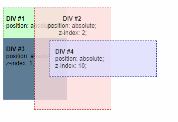
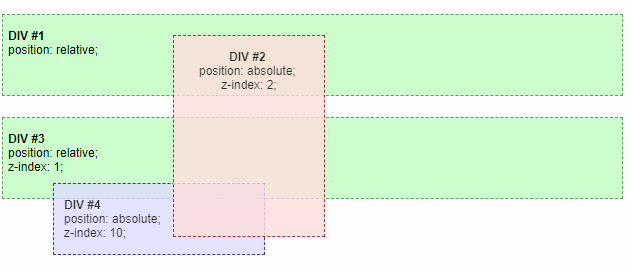
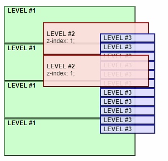
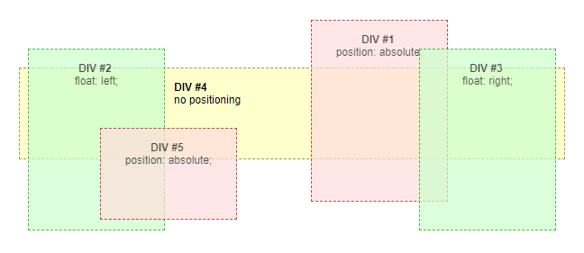

# CSS 层叠上下文

## 一、概念简介
> 层叠上下文是HTML元素的三维概念，这些HTML元素在一条假想的相对于面向（电脑屏幕的）视窗或者网页的用户的z轴上延伸，HTML元素依据其自身属性按照优先级顺序占用层叠上下文的空间（*摘自MDN*）。一个元素首先要先拥有了层叠上下文，然后才能给它设置层叠上下文的等级，也就是z-index属性。

> 通俗来说就是，一个网页中的每一个HTML元素并不是直接平铺在网页上的，而是以分层叠放的形式展现出来的，每个HTML元素的样式属性决定了它们分别属于哪一层。而要使一个元素具有层叠上下文，则必须包含以下任意条件：
> * 根元素（HTML）默认具有层叠上下文
> * `z-index` 值不为 "auto"的 绝对/相对定位
> * `position`: fixed定位
> * 一个 `z-index` 值不为 "auto"的 flex 项目 (flex item)，即：父元素 `display: flex|inline-flex`
> * `opacity` 属性值小于 1 的元素（即不透明的元素）
> * `transform` 属性值不为 "none"的元素
> * `mix-blend-mode` 属性值不为"normal"的元素(*mix-blend-mode CSS 属性描述了元素的内容应该与元素的直系父元素的内容和元素的背景如何混合*)
> * `isolation` 属性被设置为"isolate"的元素(该属性的主要作用是当和background-blend-mode属性一起使用时，可以只混合一个指定元素栈的背景：它允许使一组元素从它们后面的背景中独立出来，只混合这组元素的背景)
> * `filter` 值不为“none”的元素(CSS滤镜/filter属性提供的图形特效，像模糊，锐化或元素变色。过滤器通常被用于调整图片，背景和边界的渲染)
> * `perspective`值不为“none”的元素
> * 在 `will-change` 中指定了任意CSS 属性，即便你没有直接指定这些属性的值
> * `-webkit-overflow-scrolling` 属性被设置"touch"的元素

-----

## 二、不包含`z-index`的层叠关系
> 当没有元素包含z-index属性时，元素按照如下顺序堆叠（从底层到顶层顺序）：
> 1. 根元素的背景和边界
> 2. 普通流(无定位)里的块元素(没有position或者position:static;)按HTML中的出现的先后顺序堆叠
> 3. 定位元素按HTML中的出现的先后顺序堆叠

> 不包含z-index属性的层叠关系示例图如下：

> 其中，元素结构关系如下：
> * Root
>   * DIV #1
>   * DIV #2
>   * DIV #3
>   * DIV #4
>   * DIV #5

-----

## 三、包含`z-index`的层叠关系
> * 具有层叠上下文的元素它的子元素也按照上述条件进行层叠；
> * 每个元素的层级只与它的兄弟元素之间作对比，当兄弟元素之间内容有重叠时，将按照各自的z-index值的大小进行层叠；
> * 子元素一定是在父元素的基础之上进行层叠的，z-index为正数时向上层叠，z-index为负数时向下层叠；
> * 子元素的z-index只在父元素范围内有效，与父元素的兄弟元素或祖先元素都无关，也没有可比性；
> * 子级层叠上下文被自动视为父级层叠上下文的一个独立单元。
> * 对于没有创建层叠上下文的元素，则默认按照父元素的层级显示

> 包含z-index属性的层叠关系示例图如下：

> 在这个例子中，每个被定位的元素都创建了独自的层叠上下文，因为他们被指定了定位属性和 z-index 属性。层叠上下文的层级如下：
> * Root
>   * DIV #1
>   * DIV #2
>   * DIV #3
>       * DIV #4
>       * DIV #5
>       * DIV #6

> 这里 DIV#4，DIV #5 和 DIV #6 是 DIV #3 的子元素，所以它们的层叠完全在 DIV #3 中被处理。一旦 DIV #3 中的层叠和渲染处理完成，DIV #3 元素作为一个整体传递给 root 元素，并相对兄弟元素层叠。

> **【注意】** 
> 1. z-index只对指定了 positioned属性（非static）的元素有效
> 2. 通常HTML的层次结构和层叠上下文的层次结构是不同的。在层叠上下文的层次结构中，没有创建层叠上下文的元素同其父级处于一个层叠上下文。

### 1. 无嵌套
> 在下面的例子中，DIV #2、DIV #3 和 DIV #4 这三个DIV属于同一个层叠上下文，分别设置了z-index为2,1,10，可以看出同一层叠上下文中，DIV按照z-index的值大小来确定展示顺序。

> 其中，HTML元素结构关系如下：
> * DIV #1
> * DIV #2
> * DIV #3
> * DIV #4

### 2. 双层嵌套
> 在下面的例子中，DIV #2 和 DIV #3 其实是属于同一个层叠上下文（根元素创建的层叠上下文），因为DIV #1 没有创建层叠上下文，所以创建了层叠上下文的子元素DIV #2 提升到了和DIV #1的兄弟元素同一个层叠上下文中，又由于DIV #2 的z-index为2，而DIV #3 的z-index为1，所以DIV #2 位于 DIV #3 上方， z-index的值决定了元素如何叠放。而DIV #2 (z-index: 2)在DIV #4 (z-index: 10)的上面，尽管DIV #2的z-index值小于DIV #4。原因在于它们不属于同一个层叠上下文。DIV #4处于DIV #3所创建的层叠上下文中，而整个DIV #3（包含其后代元素）是在DIV #2下面的。

> 其中，HTML元素结构关系如下：
> * DIV #1
>   * DIV #2
> * DIV #3
>   * DIV #4

### 3. 三层嵌套
> 下面的例子是一个用多个定位的div实现的三级菜单的例子，一级菜单仅仅是相对定位，所以没有创建层叠上下文。二级菜单相对其父元素（一级菜单）绝对定位，要使二级菜单在所有一级菜单的上方，则需要使用z-index。此时每个二级菜单都创建了一个层叠上下文，而三级菜单也处于其父元素（二级菜单）创建的上下文中。这样一来，在HTML结构中处于三级菜单后面的二级菜单，则会显示在三级菜单的上方，因为所有的二级菜单都使用了同样的z-index值，处于同一个层叠上下文中，所以后面的二级菜单会覆盖在前面的二级菜单之上（包括前面那个二级菜单的子元素之上）。

> 其中，层叠上下文结构如下：
> * root stacking context
>   * LEVEL #1
>       * LEVEL #2 (z-index: 1)
>           * LEVEL #3
>           ...
>           * LEVEL #3
>       * LEVEL #2 (z-index: 1)
>        ...
>       *LEVEL #2 (z-index: 1)
>   * LEVEL #1
>   ...
>   * LEVEL #1

-----

## 四、带浮动元素的层叠关系
> 对于浮动的块元素来说，层叠顺序变得有些不同。浮动块元素被放置于非定位块元素与定位块元素之间，元素按照如下顺序堆叠（从底层到顶层顺序）：
> 1. 根元素的背景与边框
> 2. 位于普通流中的后代块元素按照它们在 HTML 中出现的先后顺序层叠
> 3. 浮动块元素
> 4. 常规流中的后代行内元素（内容）
> 5. 定位的后代元素按照它们在 HTML 中出现的先后顺序层叠

> 包含float属性的层叠关系示例图如下：

> * 在上面的例子中，DIV #4 的透明度是为 1 的，也没有设置position，所以没有层叠上下文，位于最底层，但是当给它设置一个透明度时，它就具有了层叠上下文，和其它四个元素处于同一个级别了，所以DIV #4 将会覆盖在1/2/3之上，在DIV #5 之下（后来居上）。
> * DIV #2 和 DIV #3 都是float元素，是没有层叠上下文的，z-index值为auto，而DIV #1 和 DIV #5 虽然设置了position，创建了层叠上下文，但是他们的z-index值也是auto，所以跟两个float元素其实是在同一个级别上的，所以会按照HTML结构中的先后顺序显示，后来居上。

> 其中，HTML元素结构关系如下：
> * Root
>   * DIV #1
>   * DIV #2
>   * DIV #3
>   * DIV #4
>   * DIV #5

## 同一个层叠上下文中的层叠顺序
