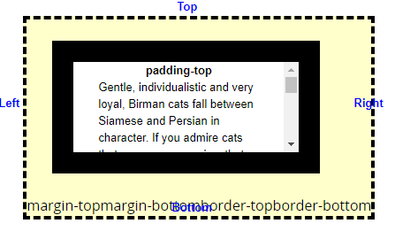

# JS window视图、Screen视图、文档视图、元素视图和鼠标位置属性汇总

## 一、window视图
> 通过window.XXX来访问，表示相对于浏览器视窗的属性值，这里主要讲述`innerWidth/innerHeight、outerWidth/outerHeight、scrollX/scrollY、pageXOffset/pageYOffset、screenX/screenY` 十个属性。

### 1. innerWidth/innerHeight（IE8及以下不支持）
> 只读属性，没有默认值，表示获取浏览器视口（viewport）的内部宽度/高度，包括滚动条，不包括菜单栏、工具栏。

### 2. outerWidth/outerHeight（IE8及以下不支持）
> 只读属性，没有默认值，表示获取浏览器视口（viewport）的整个外部宽度/高度，包括菜单栏、工具栏等。

### 3. scrollX/scrollY（IE8及以下不支持）
> 只读属性，没有默认值，表示获取整个页面滚动的宽度和高度。

### 4. pageXOffset/pageYOffset（IE8及以下不支持）
> 只读属性，没有默认值，表示获取整个页面滚动的宽度和高度。  
> *注意： `pageXOffset/pageYOffset` 属性是 `scrollX/scrollY` 属性的别名，为了跨浏览器兼容性，请使用 `pageXOffset/pageYOffset` 代替 `scrollX/scrollY`*  
> 对于IE8及以下的低版本浏览器，兼容性代码如下：
```javascript
var x = (window.pageXOffset !== undefined) ? window.pageXOffset : (document.documentElement || document.body.parentNode || document.body).scrollLeft;
var y = (window.pageYOffset !== undefined) ? window.pageYOffset : (document.documentElement || document.body.parentNode || document.body).scrollTop;
```

### 5. screenX/screenY（IE8及以下不支持）
> 表示浏览器左边界到操作系统桌面左边界的水平距离和浏览器上边界到操作系统桌面上边界的垂直距离（不包括系统工具栏的宽度或高度）。

## 二、Screen视图
> 通过window.screen.xxx来访问，表示相对于显示器窗口的属性值，这里主要讲述 `availWidth/availHeight、width/height、availLeft/availTop` 六个属性。

### 1. availWidth/availHeight（所有浏览器基本都支持）
> 表示浏览器的屏幕的可用宽度/高度，不包括系统的任务栏

### 2. width/height（所有浏览器基本都支持）
> 表示显示器屏幕的宽高,包括了系统的任务栏的宽度/高度

### 3. availLeft/availTop
> 表示浏览器可用空间左边/上面距离屏幕（系统桌面）左边界/上边界的距离，大多数情况下返回值都为0，当使用双屏时，该值取决于哪一个是主屏，主屏为0，副屏为主屏的width（在右边）或-width（在主屏的左边）。

## 三、文档视图
> 用于获取相对于document的一些属性值，这里主要讲述 `elementFromPoint()、getClientRects()、getBoundingClientRect()和scrollIntoView()` 四个方法。

### 1. elementFromPoint()
> 该方法返回给定坐标处所在的元素。这个方法可以用来检测元素是否发生重叠或是碰撞  
> 用法：`document.elementFromPoint(100,100)`

### 2. getClientRects()
> 该方法返回一个指向客户端中每一个盒子的边界矩形的矩形集合（只针对行内元素）。 返回的结果是个对象列表，具有数组特性。
> 用法：`element.getClientRects()`

### 3. getBoundingClientRect()
> 该方法得到矩形元素的界线，返回的是一个对象，包含 top, left, right, 和 bottom四个属性值，大小都是相对于文档视图边界计算而来，包括了滚动的距离。 
> 用法：`element.getBoundingClientRect()`

### 4. scrollIntoView()---基本所有浏览器都支持
> 该方法让元素滚动到可视区域  
> 用法：`element.scrollIntoView()`

## 四、元素视图
> 通过element.xxx来访问，表示与HTML元素相关的一些属性，这里主要讲述 `clientWidth/clientHeight、clientLeft/clientTop、offsetLeft/offsetTop、offsetParent、offsetWidth/offsetHeight、scrollLeft/scrollTop、scrollWidth/scrollHeight` 等13个常用属性。

### 1、clientWidth/clientHeight---基本所有浏览器都支持
> * **只读属性**，表示元素的内部宽度/高度（包括content、padding），不包括border、margin和滚动条。对于没有宽高的行内元素或者设置了 `display:inline` 的块级元素，该值都为0。


### 2、clientLeft/clientTop---基本所有浏览器都支持
> * **只读属性**，表示元素内容区域的左上角相对于整个元素左上角的位置（包括边框），不包括顶部外边距或内边距，即元素的四个border-width。  
> *注意：该值可能因为浏览器的自身属性会有差异，例如，FF和IE浏览器的按钮默认有3px大小的边框值，而Chrome的只有2px*



### 3. offsetLeft/offsetTop---基本所有浏览器都支持
> **只读属性**，对于块级元素，该属性表示当前元素左上角相对于最近的祖先定位元素（非static元素），也就是`element.offsetParent` 的左右/上下偏移值；对于行内元素，该属性表示元素第一个边界框的位置。

### 4. offsetParent---基本所有浏览器都支持
>  **只读属性**，该属性表示离当前元素最近的祖先定位元素，若无定位元素，则 `offsetParent` 为最近的 `table, table cell` 或根元素（标准模式下为 html；怪异模式下为 body）。当元素的 `style.display` 设置为 `"none"` 时，`offsetParent` 返回 `null`。`offsetParent` 很有用，因为 `offsetTop` 和 `offsetLeft` 都是相对于其内边距边界的。  
> *注意：在IE和Opera浏览器下，position: fixed的元素没有offsetParent（null）*

### 5. offsetWidth/offsetHeight---基本所有浏览器都支持
> **只读属性**，表示当前元素的宽度/高度，包括content、padding、border和滚动条。


### 6. scrollLeft/scrollTop---基本所有浏览器都支持
> **可读写属性**，该属性元素滚动的像素大小，可手动设置为整数值。
> * 如果元素不能滚动（比如：元素没有溢出），那么scrollLeft 的值是0。
> * 如果给scrollLeft 设置的值小于0，那么scrollLeft 的值将变为0。
> * 如果给scrollLeft 设置的值大于元素内容最大宽度，那么scrollLeft 的值将被设为元素最大宽度。

### 7. scrollWidth/scrollHeight---IE8以下不支持
> **只读属性**，该属性返回元素的内容区域宽度（存在滚动条时）或元素的本身的宽度中更大的那个值。即：
> * 没有隐藏部分（无滚动条）：等同于 `clientWidth和clientHeight`
> * 有隐藏部分（有滚动条）：等同于 `scrollLeft + clientWidth/scrollTop + clientHeight`


## 五、鼠标位置
> 通过event.xxx来访问，表示与鼠标事件相关的一些属性。这里主要介绍`clientX/clientY、offsetX/ offsetY、pageX/pageY、screenX/screenY、x/y` 十个属性。

### 1. clientX/clientY---基本所有浏览器都支持
> **只读属性**，该属性表示事件发生时，目标元素（鼠标）与客户端区域（浏览器窗口window）的水平/垂直距离，不包括工具栏和滚动条，也不包括已滚动的高度。

### 2. offsetX/ offsetY---IE7以下不支持、FF4以下不支持（实验中的功能，非标准用法）
> **只读属性**，该属性表示鼠标相对于事件源元素（srcElement）padding-box的X,Y坐标，只有IE事件有这2个属性，标准事件没有对应的属性。
> * IE7以及以下浏览器下，只有当前目标元素为offsetParent时才计算坐标值，否则，它就会拿当前目标元素的offsetParent来计算；
> * Saf 和 Chrome中是相对于border-box来计算的；
> * Opera中是相对于content-box来计算的；

### 3. pageX/pageY---IE8以下不支持（非标准属性，但广泛支持）
> **只读属性**，该属性表示鼠标相对于document文档的X、Y偏移量，包括滚动的距离。

### 4. screenX/screenY---基本所有浏览器都支持
> **只读属性**，该属性表示鼠标相对于显示器屏幕的X、Y偏移量。

### 5. x/y---FF4以下不支持
> `clientX/clientY` 的别称，等同于`clientX/clientY`。

## 六、总结
> * 网页可见区域宽： document.body.clientWidth;
> * 网页可见区域高： document.body.clientHeight;
> * 网页可见区域宽： document.body.offsetWidth   (包括边线的宽);
> * 网页可见区域高： document.body.offsetHeight  (包括边线的宽);
> * 网页正文全文宽： document.body.scrollWidth;
> * 网页正文全文高： document.body.scrollHeight;
> * 网页被卷去的高： document.body.scrollTop;
> * 网页被卷去的左： document.body.scrollLeft;
> * 网页正文部分上： window.screenTop;
> * 网页正文部分左： window.screenLeft;
> * 屏幕分辨率的高： window.screen.height;
> * 屏幕分辨率的宽： window.screen.width;
> * 屏幕可用工作区高度： window.screen.availHeight;
> * 屏幕可用工作区宽度：window.screen.availWidth;