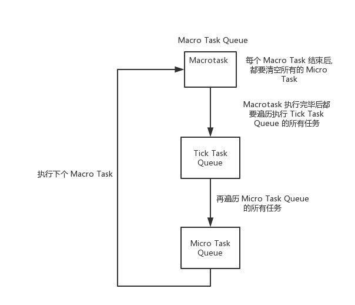

# JS 异步操作的执行顺序问题(不同队列)
### `setTimeout/setInterval/setImmediate/Promise/process.nextTick`

## JS任务介绍
> JS任务分为同步任务和异步任务。同步任务指的是，在主线程上排队执行的任务，只有前一个任务执行完毕，才能执行后一个任务；异步任务指的是，不进入主线程、而进入"任务队列"（task queue）的任务，只有"任务队列"通知主线程，某个异步任务可以执行了，该任务才会进入主线程执行。

> 浏览器中, js引擎线程会循环从任务队列中读取事件并且执行, 这种运行机制称作 Event Loop (事件循环).

## 任务队列介绍(TaskQueue)
> JS任务队列可以主要有`Macro-TaskQueue/Micro-TaskQueue/Tick-TaskQueue`三种。
> * `Macro-taskQueue`：相当于JS中的主线程，处理正常顺序的主线程任务，包括`rendering`, `script`(页面脚本), 鼠标, 键盘, 网络请求等事件触发，以及通过 `setTimeout`、 `setInterval` 和 `setImmediate` 添加的任务；
> * `Micro-TaskQueue`： 相当于JS中的异步任务线程，主要用于保 存`Promise.then` 创建的异步任务;
> * `Tick-TaskQueue`： 是介于`Macro-TaskQueue` 和 `Micro-TaskQueue` 之间的一个任务队列，主要用于保存`node.js` 中的 `process.nextTick` 异步事件。`node.js` 中有一个_tickCallback函数，在每一次执行完Macro-TaskQueue的一个任务之后被调用，_tickCallback函数主要做了以下两件事：
>   1. 第一步，将当前Tick-TaskQueue当中的所有任务执行完；
>   2. 第二步，执行_runMicroTask函数，执行Micro-TaskQueue当中的任务。

> * 三者的结构图如下：



## 回调优先级对比
> **`process.nextTick > promise.then > setTimeout > setImmediate`**

*注意：`setImmediate` 每次都添加在`Macro-TaskQueue`的队尾*

> 当发生在递归调用的时候，setImmediate指定的回调函数，总是排在setTimeout前面，如下：
```javascript
setImmediate(function () {
    setImmediate(function A() {
        console.log(1);
        setImmediate(function B() {
            console.log(2);
        });
    });

    setTimeout(function timeout() {
        console.log('TIMEOUT FIRED');
    }, 0);
});
// 1
// TIMEOUT FIRED
// 2
```

> 这是因为setImmediate总是将事件注册到下一轮Event Loop，所以函数A和timeout是在同一轮Loop执行，而函数B在下一轮Loop执行。